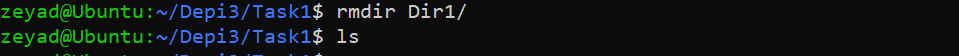

Task1 SOLUTION

#Print Working Directory

`pwd` command used to print working directory

#Create and Delete Directory
`mkdir` command used to create directories

`rmdir` command used to delete empty directory

#Preview Data In File

`cat /etc/passwd`
`head -n 2 /etc/passwd`
`tail -n 2 /etc/passwd`

#File Mangement
`touch` command used to create a file

`cp src dst` copy from source to destination

`mv src dst` move content from source to destination

`mv file-old-name file-new-name` rename a file

# Change Permissions
`chmod` command used to change permissions
`chmod 764 file`
`chmod u=rw,g=r,o=r file`

# Search in File or Directory
`grep` command used to search in file

# `history` and `date` command

# alias and unalias command
`alias` used to alias command

# Adding User and Switch to it
`useradd` command to add user

`su - user` command switch to user

# Deleting User
`userdel` command used to delete user

